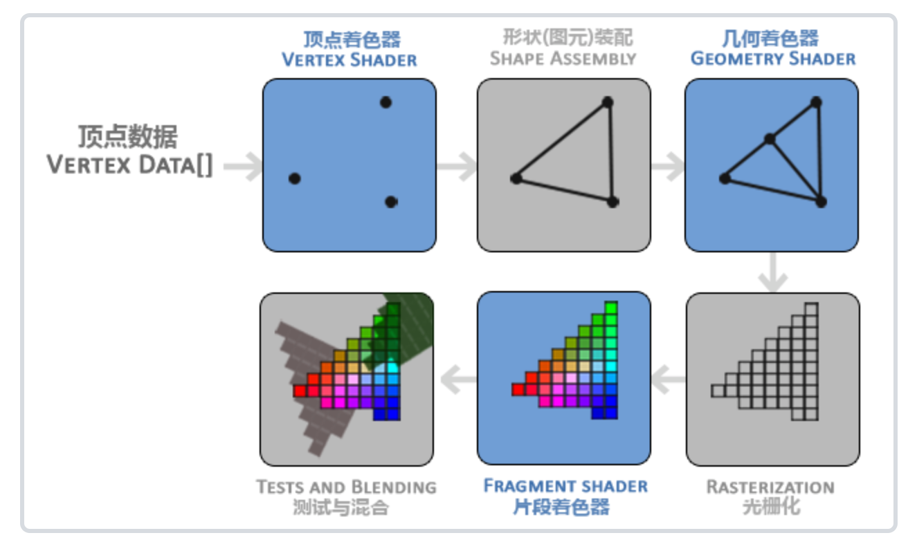
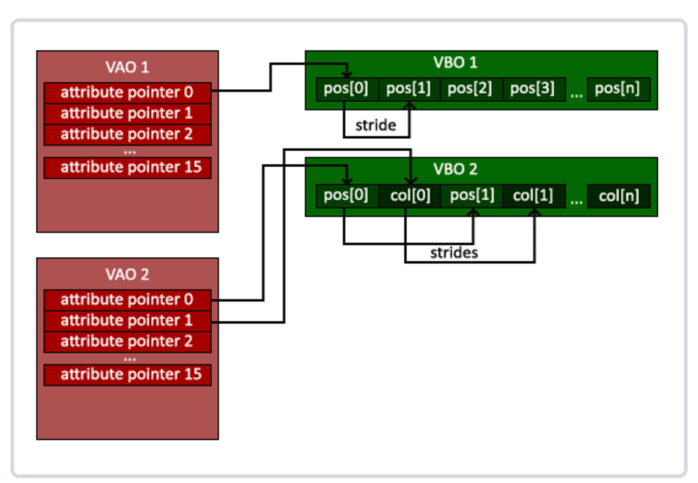

## 用OpenGL搭一下作业框架

### 渲染管线



蓝色部分可以自定义

**图元（primetive）**：```GL_POINTS、GL_TRIANGLES、GL_LINE_STRIP```等


### OpenGL对象

> https://www.zhihu.com/question/39082624

**VBO**：管理显存里的一块内存，存储顶点数据

```cpp
unsigned int VBO;
glGenBuffers(1, &VBO);

// 把这个VBO绑定到GL_ARRAY_BUFFER类型，之后使用GL_ARRAY_BUFFER类型，就是对这个VBO的改动
glBindBuffer(GL_ARRAY_BUFFER, VBO);

// 根据CPU与GPU上VBO交换数据的频繁度
// GL_STATIC_DRAW： 数据几乎不会改变
// GL_DYNAMIC_DRAW：数据会被改变很多
// GL_STREAM_DRAW ：数据每次绘制时都会改变
glBufferData(GL_ARRAY_BUFFER, sizeof(vertices), vertices, GL_STATIC_DRAW);


// 设置顶点属性指针
glVertexAttribPointer(0, 3, GL_FLOAT, GL_FALSE, 3 * sizeof(float), (void*)0);
glEnableVertexAttribArray(0);


// 解绑VBO
glBindBuffer(GL_ARRAY_BUFFER, 0);
```


**VAO**：

一个VBO存储一组顶点数据，每个顶点有pos, color, normal等信息。

一个VAO对应一个VBO，存储着每一个属性的指针。



**EBO**: 顶点 + 索引

```cpp
float vertices[] = {
    0.5f, 0.5f, 0.0f,   // 右上角
    0.5f, -0.5f, 0.0f,  // 右下角
    -0.5f, -0.5f, 0.0f, // 左下角
    -0.5f, 0.5f, 0.0f   // 左上角
};

unsigned int indices[] = {
    0, 1, 3, // 第一个三角形
    1, 2, 3  // 第二个三角形
};

```


