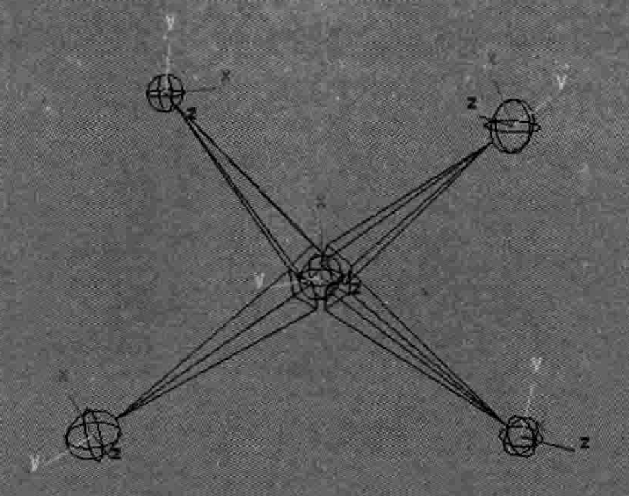
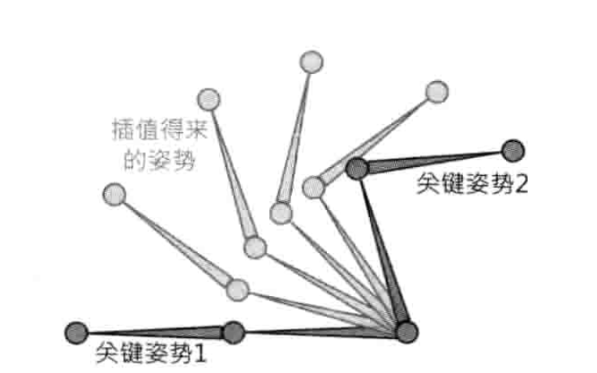
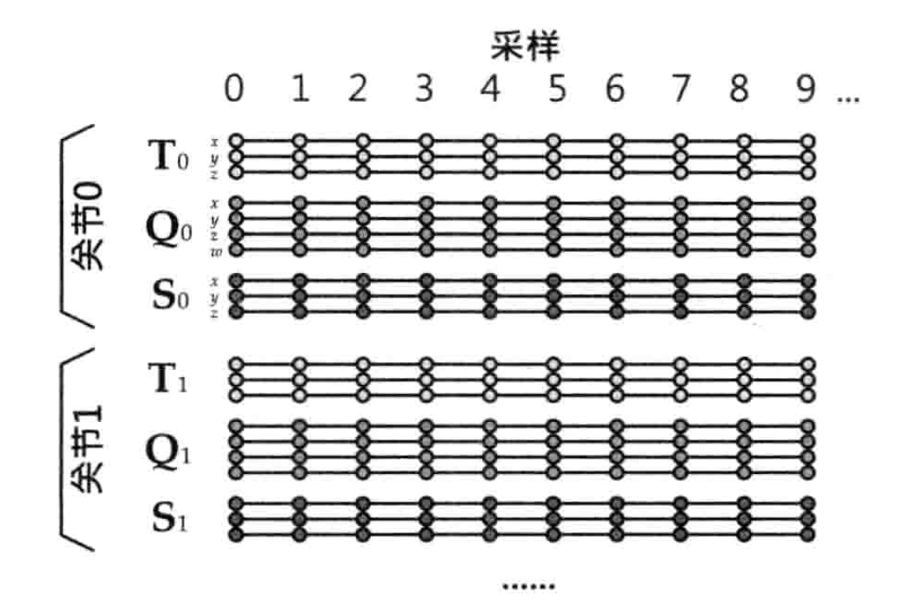
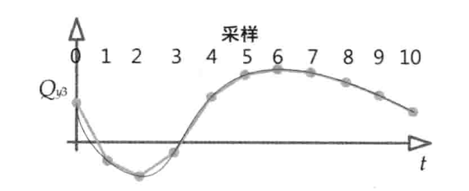

## 蒙皮/骨骼动画

### 数据结构

skeleton(骨骼) 		 由层级的关节（joint）构成

bone(骨头)					不实际存在，是关节间的空位

joint（关节）			

skin（皮肤）     		三角mesh绑定在joint上

```cpp
struct Joint{
  Mat4x4 m_invBindPose;
  int m_parent;
  string m_name;
}

struct Skeleton{
  int m_count;
  Joint* m_joints;
}
```

### 姿势（Pose）

关节的姿势定义为：关节相对某参考系的变化矩阵，一般mat4x4或SQT（scale、quaternion、translation）

绑定姿势（T姿势）

局部姿势：关于父关节的变换矩阵



```cpp
struct JointPose{
  Quaternion m_rotation;
  vec3 m_trans;
  float m_scale;
}

struct SkeletonPose{
  Skeleton* m_skeleton;
  JointPose* m_localPoses;
}
```

### 动画片段

比如步行、跑步、跳跃、下蹲

姿势差值



#### 动画数据格式



#### 动画重定向

把为一个skeleton设计的动画，重定向到另一个skeleton

#### 连续的通道函数

每一个joint的10个参数随时间变化的函数



### 蒙皮

一个mesh的vertex至多可以绑定到4个joint

```cpp
struct SkinnedVertex{
  float m_position[3];
  float m_normal[3];
  float m_u, m_v;
  int m_jointIdx[4];
  float m_jointWight[3]; // ommit last componennt (w1 + w2 + w3 + w4 = 1)
}
```

蒙皮矩阵：绑定姿势下vertex的pos --> 某姿态下vertex的pos

​	TODO


vertex蒙皮至多个joint，计算蒙皮到每一个joint的位置，再加权求和，权重由绑定师提供


### 动画混合（animation blending）

多个pose结合，生成最终的输出pose

用来进行插值

1. 线性lerp，对每个joint的局部pose进行lerp

这也是使用SQT的原因，而不能直接对变换矩阵mat4x4差值

### IK

eg: 蹲下来取地上的东西，保证手指碰到又不穿透