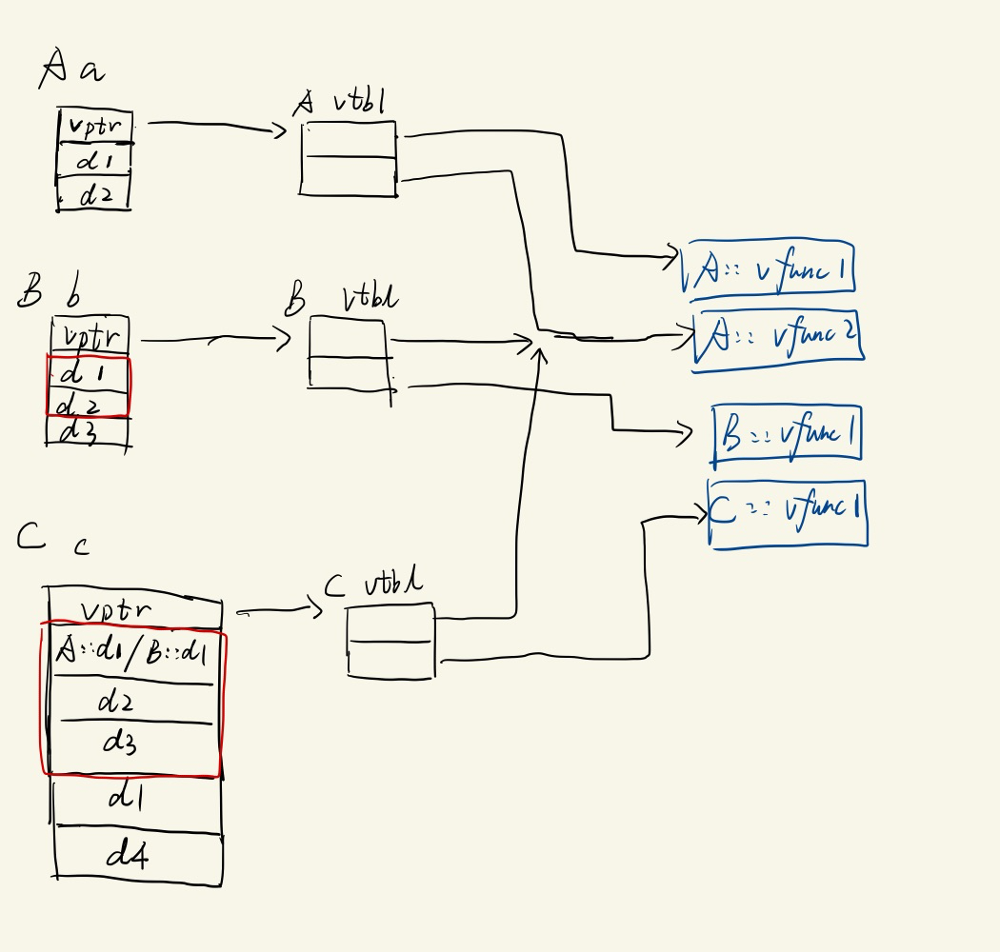
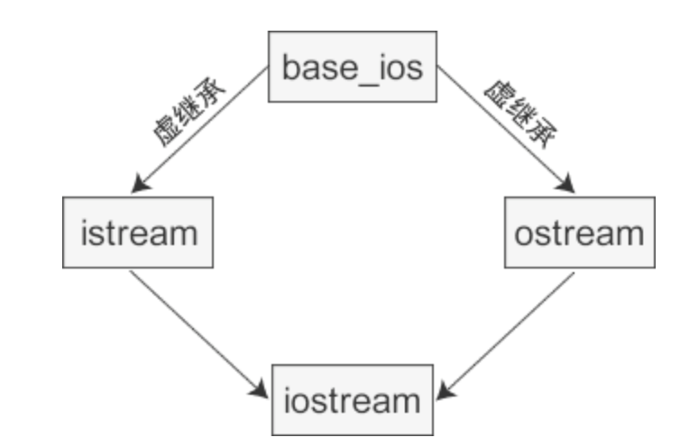
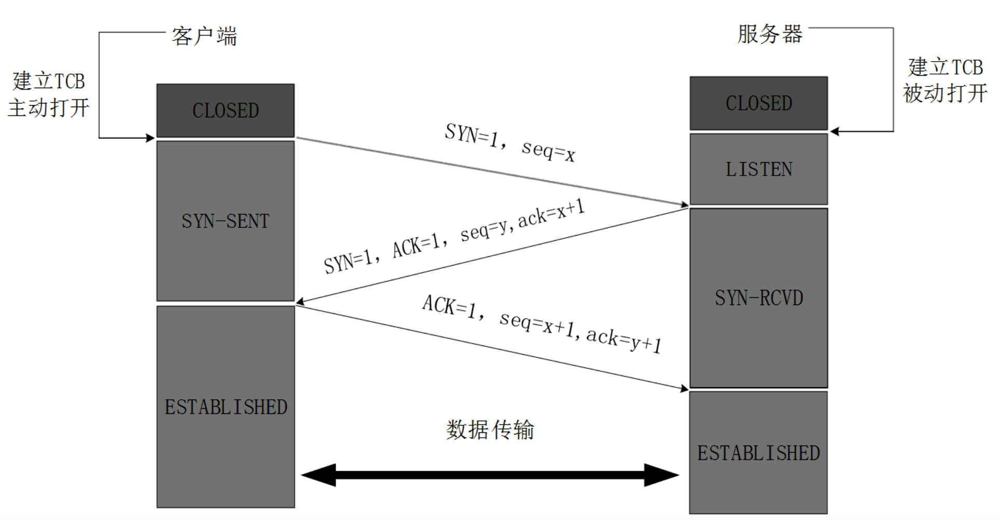
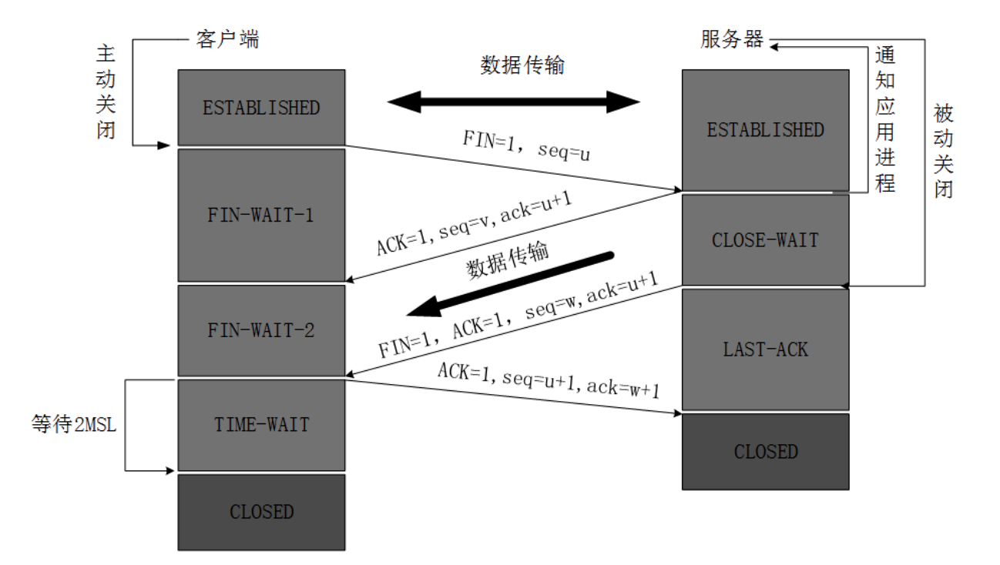
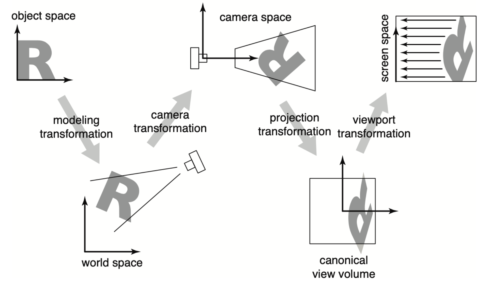
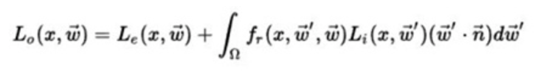
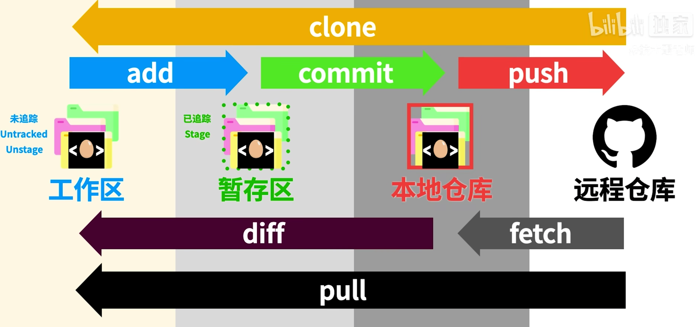
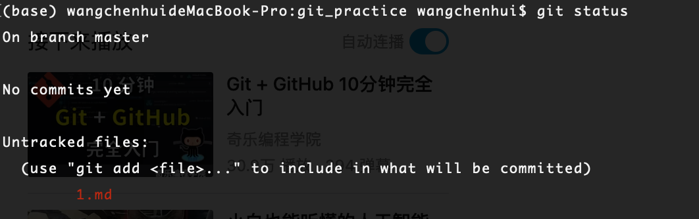
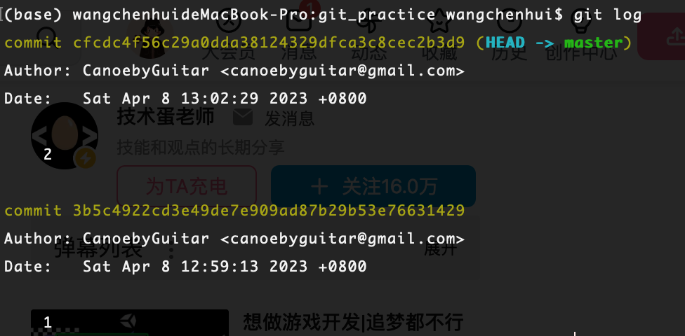

## C++

### 多态、继承、虚函数

#### **什么是多态**

**==通过指针==**调用一个对象的成员函数时，会根据该对象的具体类型来执行不同的函数。C++中通过虚函数和重写（覆盖）来实现。**使用基类指针调用虚函数的时候，它能够根据所指的类对象的不同来正确调用虚函数.**

> **只有通过指针或者引用才能表现出[多态性](https://www.zhihu.com/search?q=多态性&search_source=Entity&hybrid_search_source=Entity&hybrid_search_extra={"sourceType"%3A"answer"%2C"sourceId"%3A2165605549})，值语义是不能表现出多态的。**

比如父类surface有一个虚函数getIntersect来获得和光线的求交，他有Sphere、Triangle两个子类，对其虚函数进行了重写，在调用getIntersect方法是具体执行哪个取决于调用对象的具体类型。

#### **继承**：

（一般工程上只用public继承）子类会继承父类全部的public和private成员变量(包括父类从父类的父类那里继承过来的)（在内存中存在）和成员函数的使用权（在内存中不存在），子类可以选择直接继承或者重写（overwrite）。

* 不同名函数会直接继承

*  同名非virtual函数会自己继承（Base::void f() 和 Derived::void f()同时存在，是不同的两个东西）
* 同名virtual函数会重写

```cpp
class Base{
public:
    Base(){data = 0;}
    virtual void vf1(){
        data++;
    }

    virtual void vf2(){
        data = data + 2;
    }

    void f1(){
        data = data + 3;
    }
    int data;
};

class Derived : public  Base{
public:
    void vf1() override{
        data--;
    }
    void f1(){
        data = data - 2;
    }
};

Base b;
Derived d;

//    d.vf1();
//    cout << d.data; // -1

//    d.f1();
//    cout << d.data; // -2

//    d.vf2();
//    cout << d.data; // 2

d.Base::f1();
cout << d.data; // 3
```


#### **虚函数实现机制**：

C语言函数和C++对象非虚函数是**静态绑定**的，在**编译期**确定函数地址，调用一个函数，会直接定位到某个函数地址，结束后再返回。

C++面向对象虚函数是**动态绑定**的，在**运行时**确定函数地址（满足一定条件，参加下方）。

带虚函数的类对象被创建时，所占内存空间的开头会有一个vptr，指向一个vtbl，vtbl里每一行会指向一个虚函数。当子类继承父类的某个虚函数，并对其进行重写时，会修改vtbl中对应的表项所指向的地址。

>  父类有虚函数，子类一定也有继承到的虚函数（可以选择不动或者重写），所以一定也有vptr。

当某个对象执行某个虚函数时，编译器会通过vptr，在这个对象的vtbl中查找到该函数的地址，并调用该函数。所以即使时同名函数，由不同对象调用时，会有不同的效果。

```cpp
class A{
public:
    virtual void vfunc1();
    virtual void vfunc2();
    void func1();
    void func2();

    int m_data1, m_data2;
};

class B: public A{
public:
    virtual void vfunc1();
    void func2();


    int m_data3;
};

class C: public B{
public:
    virtual void vfunc1();
    void func2();

    int m_data1, m_data4;
};

```



**虚函数表存放在常量区（.rodata）**


#### **虚函数调用是在编译时确定还是运行时确定的？如何确定调用哪个函数？**

运行期确定的叫**动态绑定**

三个条件：

1. 虚函数重写
2. 指针或引用类型
3. 向上转型（子类向父类）Upcasting

```cpp
void fun(Base *b){
  b->f();
}
```

在编译时，编译器并不知道b具体是什么（可能是Base对象，也可能是Derived对象），所以要在运行时去对应对象的vtbl中取函数地址。

但如果是值传递，就不是动态绑定了，在编译期就能确定相应函数的地址。

```cpp
void fun(Base b){
  b.f();
}
```

通过查找虚函数表中的虚函数地址确定。

#### **虚函数是存在类中还是类对象中（即是否共享虚表）**

存在类中，共享虚函数表，为了节省内存。

#### **在(基类的)构造函数和析构函数中调用虚函数会怎么样**

构造函数：子类会先调用父类的构造函数，在构造自己特有的部分

析构函数：子类会先析构自己的部分，再调用父类的析构函数

构造函数不可以是虚函数

析构函数常常是虚函数

TODO：扩充

#### 虚表具体怎么实现的

虚表是一个指针数组，每个元素是指向一个虚函数的函数指针。

```cpp
class Base{
  virtual vf();
}
class Derived : public Base(){
  virtual vf();
}
Derived obj;
Base* b = &obj;
b->vf();
```

在对象内存模型中，obj包含vptr、Base的数据成员、Derive的数据成员， vptr指向的是Derived类的虚表, 会包含父类没有被重写的虚函数和父类被重写的虚函数。

b的类型是Base*，他指出 b的对象模型应有的大小，即只含vptr和Base的数据成员，通过vptr找到Derived类的虚表，里面可以查到被Derived重写的虚函数vfun。

#### 虚表存在哪里 为什么

只读段（常量区）.rodata 不同编译器可能不同，看过一篇gcc测试的结果是在常量区

### 内存模型

#### 空指针调用

```cpp
A* a = nullptr;
a->fun()
// 会发生什么 （正常执行，除非用到this->a, 会空指针报错，因为普通成员函数的地址在编译后已经确定）
 
// 如果fun是virtual的呢 （不能执行，因为没有虚指针）
```


#### 对象的内存模型布局

1. 有虚函数的话，虚函数指针（vptr）在开头

2. 除虚函数，会按照 **先父类继承数据 后子类特有数据** 和 **字段声明顺序**布局

3. 多继承，会按照 **（1）有虚函数的父类 vptr和成员变量 （2）没有虚函数的父类的成员变量 （3）子类自己的成员变量**，如果子类重写父类虚函数，就在相应的父类的虚表的相应位置覆盖，如果子类有自己的虚函数，就增加在第一个有虚函数的父类的虚表里。

4. 菱形继承，并采用虚继承，会按照**（1）各个父类（包含vptr）（2）子类（3）公共基类（最上方类，包含vptr）。 并且父类不再拷贝公共基类中的成员变量**

   


#### 菱形继承的问题和解决方法

**问题**：两个父类会同时拷贝公共父类的成员变量，造成**二义性**，以及不必要的内存开销。如果不加以类限定符修饰会导致编译错误。

**解决**：虚继承，父类继承公共父类时使用virtual修饰


#### c++内存区域

C++特有的，和C和OS有些区别

1. 堆（heap）：malloc和free创建和释放
2. **自由存储区**： **new和delete创建和释放（具体存放位置可能是堆或静态变量做的内存池）**
3. 栈（stack）：函数局部变量
4. 全局/静态存储区（.bss/.data）：C语言中未初始化等在.bss中，初始化等在.data中，c++不作区分
5. 常量存放区（.rodata）: 常量，不允许修改
6. 代码区（.text）

默认值：

全局区对象的内存保证在程序启动时被清0；

局部对象（栈）、动态申请对象（堆）不会清0，保留上次使用后的遗迹

#### 堆和栈的区别

* 堆需要手动申请和释放， 栈由操作系统自动申请、释放
* 堆能分配的内存比较大（4G（32位机器）），栈能分配的内存较小（1M）
* 堆中分配释放会产生内存碎片
* 栈地址从大到小， 堆地址从小到大

#### C++和C的分配、释放内存区别

* new分配无需指明大小，malloc需要
* new返回类型指针，malloc返回void*，再强转到所需要的类型
* new从自由区获得内存，malloc从堆
* **类中，new、delete可以调用构造和析构函数**

#### 内存对齐

**原因**：CPU取数据是按照固定长度，不对齐的话，一些数据可能设计读两次内存，然后进行掩码、移位放入寄存器中。对齐可以提高读写、计算效率

**做法：**

1. 对齐大小 = **min(对齐模数， 最长数据成员的字节数)**， 对齐模数可以通过#pragma pack(n)指定，gcc,clang默认是8（取决于平台，在我的mac上是8）
2. 每个数据成员的起始地址是  **min(该数据成员字节数， 对齐大小)** 的整数倍
3. 末尾仍需补齐到对齐大小的整数倍

例子：

```cpp
struct{
  short a;
  int b;
  double c;
}

#pragma pack(4)
0.......31
--a--*****
-----b----
-----c----
-----c----
  

#pragma pack(8) 
0...............63
--a--*****----b---
---------c--------

```


### 类型转换

#### static_cast\<T>和（T）的区别

static_cast限制更多，更安全；

基本类型 转值类型可以通过， 转指针类型不一定能通过

c风格类型转换更自由

```cpp
 unsigned char buffer[] = { 0x00, 0x00, 0x00, 0x40 };
//error
float* p1 = static_cast<float*>(buffer);

// C-style: correct
float* p2 = (float *)buffer;

// Cpp-style: correct
float* p3 = reinterpret_cast<float*>(buffer);

std::cout << *p2 << " " << *p3;
```


#### **C++有哪些类型转换的方法(关键字)，各自有什么作用**

转换只是一种编译器指令，不改变一个指针所指向的真实地址，只影响“**编译器对指向的地址的大小和内容的解释**”

(1)**const_cast** 

​	将const转换为非const, 只能用于指针或引用，只能改变底层const

* 底层const：指向的对象是const
* 顶层const：本身是const

```cpp
int a = 1;
const int &b = a;
const_cast<int&> b = 3;
```

(2)**static_cast**

​	隐式类型转换，可以实现C++内置基本数据类型之间的转换，也能进行**value或pointer/referennce**层次间向上或者向下的转换（向下不安全），不能作用于包含底层const的对象

(3)**dynamic_cast**

​	动态类型转换，将父类的**指针或引用**安全的转换成派生类指针（或引用），转换失败返回false（指针）/throw（引用）

​	运行时安全检查


```cpp
class ZooAnimal{
  public:
  ZooAnimal();
  virtual ~ZooAnimal();
  virtual void rotate();
  
  protected:
  int loc;
  String name;
}

class Bear : public ZooAnimal{
  public:
  Bear();
  ~Bear();
  void rotate();
  virtual void dance();
  
  protected:
  Dances dance;
  int cell_block;
}

Bear b;
ZooAnimal *pz = &b;
Bear *pb = &b;

// 不合法
pz->cell_block;

// 解决方法
// downcast
(static_cast<Bear*>(pz))->cell_block;

// 这样更好, 但执行期判断，成本较高
if(Bear* pb2 = dynamic_cast<Bear*>(pz)){
  pb2->cell_block;
}
```


(4)**reinterpret_cast**

​	按二进制换一种意思解释（比如32位int 机器语言不变 解释成32位float）

#### static_cast和dynamic_cast的区别

static_cast在编译器进行安全检查，dynamic_cast在运行时检查

dynamic_cast需要父类有虚函数

### 智能指针

#### 野指针

指向不可用内存区域的指针叫野指针

有三种情况：

* 指针变量没有被初始化
* 指针指向的内存被释放了，但指针本身没有改为nullptr。（比如string浅拷贝，被另一个对象释放了空间）
* 指针超过了变量的作用范围。（比如某函数内部的局部变量的地址被传出来使用、指针形式访问数组元素且越界）

**怎么debug**

* 静态代码检查工具 Valgrind (https://zhuanlan.zhihu.com/p/508470880)
* debug模式下，编译器可能会初始化变量为特殊值，比如0xccccccc
* 打印一些值，如果每次执行结果都不一样，考虑可能是野指针问题，去控制变量定位问题。
* 预防：delete和p=nullptr成对出现、初始化的习惯

#### 内存泄漏

某些申请堆资源的类没有写析构函数（编译器会补上，但只会byte by byte的拷贝）

#### 什么是智能指针

* ==不可以对栈区临时对象用shared_ptr（否则会double free）==
* ==不可以对同一个堆区对象重复构造shared_ptr，他们不会共享counter，可能会double free==

解决内存泄漏问题，本身是一个类，函数结束时调用析构函数，释放内存空间

（1）shared_ptr：多个共享指针可以指向相同的对象，采用了引用计数的机制，当最后一个引用销毁时，释放内存空间

（2）unique_ptr，保证同一时间段内只有一个智能指针能指向该对象（可通过move操作来传递unique_ptr）

（3）weak_ptr，用来解决shared_ptr相互引用时的死锁问题（两个shared_ptr相互引用,那么这两个指针的引用计数永远不可能下降为0）。它是对对象的一种弱引用，不会增加对象的引用计数，和shared_ptr之间可以相互转化，shared_ptr可以直接赋值给它，它可以通过调用lock函数来获得shared_ptr。

**shared_ptr的实现原理是什么**

```cpp
namespace mm{
    template<class T>
    class shared_ptr{
    public:
        shared_ptr(){
            m_ptr = nullptr;
            m_count = new int(0);
        }

        shared_ptr(const shared_ptr<T> &p){
            m_ptr = p.m_ptr;
            m_count = p.m_count;
            if(m_ptr) (*m_count)++;
        }

        explicit shared_ptr(T *p){
            m_ptr = p;
            m_count = new int(1);
        }

        ~shared_ptr(){
            (*m_count)--;
            if(*m_count == 0){
                delete m_ptr;
                m_ptr = nullptr;
                delete m_count;
                m_count = nullptr;
            }
        }

        int use_count() const{
            return *m_count;
        }

        shared_ptr<T>& operator=(const shared_ptr<T> &p){
            (*m_count)--;
            if(*m_count == 0){
                delete m_ptr;
                m_ptr = nullptr;
            }
            m_count = p.m_count;
            m_ptr = p.m_ptr;
            (*m_count)++;
            return *this;
        }

    private:
        int *m_count;
        T *m_ptr;
    };

    template<class T>
    shared_ptr<T> make_shared(T &obj){
        shared_ptr<T> ret(&obj);
        return ret;
    }


}
```


#### 智能指针的使用

#### make_shared

会自动创建一个对象（调用对象的构造函数），并返回指向这个对象的智能指针

这样就可以了

```cpp

a = std::make_shared<A>(); // 默认构造函数

a = std::make_shared<A>(file_path); // 带参数的构造函数
```


下面是一个错误实例

```cpp
class A{
public:
    A(){
        p = new int[10];
    }

    ~A(){
        delete[] p;
    }
private:
    int* p;
};

class B{
public:
    B(){
      // error
      // 1. A（）临时变量
      // 2. 创建了一个指向A（）的智能指针
      // 3. 临时对象生命周期到，被析构
        a = std::make_shared<A>(A());
      // 但是有可能某些结果仍然正确，属于未定义行为，因为析构时并不会改变堆中的内容，只是标识内存的分配与回收
    }
private:
    std::shared_ptr<A> a;
};
```


### 各种关键字

#### using

四种用法

* introduce namespace / namespace member into other **namespaces / block scopes**
* introduce **base class** definitions into **derived class** definitions


```cpp
```


#### const

const 常量会把常量放入**符号表**，编译过程中直接使用符号表中的值替换。（除非加&修饰）

1. 修饰局部变量，表示常量不可修改
2. 修饰成员函数，（const属于函数签名一部分）表示不可修改成员变量  其实本质上是修饰*this,例如下面的写法就是错误的

```cpp
A& f() const {
        return *this; // *this的类型为const A
    }

// 修正
const A& f() const {
        return *this;
    }
```


3. 修饰函数参数，表示不可在函数中被修改，利用const &可以实现传右值给参数

指针常量和常量指针

```cpp
int const* a; // 就是const int* a   常量指针(常量的指针，a指向的单元是个常量，a本身可以修改成指向其他单元 a = &b)

int *const a;// 指针常量  （指针是常量，但指向的内存单元可以修改   *a = 2）
```

顶层const ： 本身是const

底层const：指向的对象是const

**const类对象只能调用const的成员函数；而非const对象能调用全部成员函数(两者都有时，优先调用非const函数)。**这要求类设计者，应const尽const

#### static

1. 用在文件作用域中，直接在.h/.cpp文本中使用，修饰变量表示只在本文件中可见，避免重复定义
2. 用在函数作用域中，表示局部静态变量，只在这个函数可见，但只会进行一次初始化
3. 类作用域中，静态成员变量/静态成员函数，表示这个数据/函数是所有类对象共享的，而不属于某一个对象

全局变量、文件域的静态变量、类的静态成员变量在main执行前的静态初始化过程中分配内存并初始化

局部静态变量在第一次使用时分配内存和初始化

#### extern

* extern "C" void fun(int a, int b) 告诉编译器按C去编译这个函数
* 修饰全局变量或全局函数，告诉编译器去其他模块找定义

#### explicit

构造函数是显式，不能隐式转换

#### constexpr

告诉编译器大胆的去优化这个变量，能不能在编译期就确定为常量

#### volatile

告诉编译器这个变量，一定要从内存中取，而不能从寄存器取

#### mutable

修饰const变量/函数，表示可以让他进行修改（？）

#### auto/deltype

自动类型推倒。auto不能用于函数传参和数组类型推倒，deltype可以解决这个问题

### 左值右值 右值引用

#### 浅拷贝和深拷贝

浅：简单的拷贝类对象，但不拷贝类对象可能申请的堆空间。比如某个对象，成员变量为char*，浅拷贝只拷贝了这个指针，而不拷贝指针指向内存区域，因此两个对象都指向同一快内存区域。当其中一个对象调用析构函数，free掉这块内存，就会导致另一个对象的char*变成野指针

深：同时拷贝申请的内存空间

#### 左值右值

左值是可以通过地址访问的值；右值是临时的量，比如字面常量、vector<int>()之类

#### 右值引用

为了避免无谓的拷贝，可以代替const &，并且可以修改指向的对象。

```cpp
void copy(string &&s){
  this.m_s = s;
  s = nullptr;// 必须，避免double free
}

string s = "123";
A.copy(std::move(s));
A.copy("123");
```

### 内联和宏函数

1. class内直接定义自动内联，class外需要表明inline，告诉编译器直接将定义复制过来，避免函数调用
2. 简单函数，给编译器优化建议，现在的编译器其实都是自动inline的，inline关键词只是为了在链接的时候告诉编译器只要链接一次，避免重复定义
3. 缺点是：代码膨胀，内存开销；每次修改会重新编译头文件，不方便调试
4. 和宏的区别：
   * define在预处理阶段替换；inline在编译期
   * define不会类型检查，inline会

### 杂项

#### 指针和引用

1. 指针可以为空，引用不能；

2. 指针指向一个变量，指针本身有自己的地址，可以被查到，引用是另一个变量的别名，虽然实现上通过指针，也会创建自己的内存空间，但是对程序员透明。
3. 指针可以不给初值初始化，引用必须给初值初始化（虽然不建议这么做）
4. 指针可以多级，引用只能一级


### 判断little endian/large endian

```cpp
// little endian
unsigned char bytes[] = { 0x00, 0x00, 0x00, 0x40 };  // hexadecimal value in little-endian byte order
float value;                                          // target floating-point value
std::memcpy(&value, bytes, sizeof(float));            // type punning to reinterpret bytes as a float
std::cout << value << std::endl; // 2
```

类似于这样， 可以用int  {0x80, 0x00, 0x00, 0x00}来测

或者更直观一点

```cpp
unsigned int value = 0x01020304;  // a value with known byte representation
unsigned char* ptr = (unsigned char*)&value;

if (*ptr == 0x04) {
  std::cout << "Little-endian" << std::endl;
}
else {
  std::cout << "Big-endian" << std::endl;
}
```

我的x86 mac和windows系统都是Little Endian，很多二进制文件也会编成Little Endian（比如PMX）

## STL

### vector

连续内存的数组

```cpp
class vector{
	T* start;
  T* finish;
  T* end_of_store;
}
```

扩容：

```cpp
size()  // 当前元素个数
capacity（）//总的容量大小
  
resize() // 会减小或新增元素，新增会赋初始值
reserve() // 只会改变capacity，若大于当前capacity，会copy到其他内存，并销毁原来的空间
```

扩容1.5/2倍

申请空间、元素移动、释放原空间

push_back涉及到扩容移动，所以线程不安全 ==> tbb::concurent_vector


>  慎用vector<bool> 可以用呢array<bool> 后者不会位压缩

### list

循环带头双向链表

链表结点和链表分开定义，结点包含pre、next指针和data数据

优点：不会造成内存的浪费，占用内存小

### deque

多段连续空间构成的双端队列，可以o(1)的从头和尾插入

```cpp
class deque{
T** map; //中控器
T* start;
T* finish;
}
```

中控器是一个默认长度为8的map，依次指向每一个连续区域

下标访问 o(1)但是比vector慢

头尾插入o(1) 中间比较慢

### stack和queue

以deque为底层容器

stack封住了头段开口

queue封住了尾段开口

### priority_queue

以vector作为底层容器，heap作为处理规则（静态堆）

### set和map

底层红黑树,基于链表

和AVL的区别：

* AVL不适合频繁插入、删除，会引起多次旋转操作
* 红黑树插入最多两次、删除最多三次

增删查改o(logn)，链表占用内存小

### Unordered_map/ Unordered_set

```cpp
const unordered_map <int, int> mp = {{1, 2}, {3, 4}};
// 只能这样访问 const对象只能调用const方法， 非const对象优先调用非const方法
auto value = mp.at(1);

```

```cpp
std::map<int, std::string> myMap;

// 使用 try_emplace 插入元素
auto [it, inserted] = myMap.try_emplace(1, "One");
if (inserted) {
  std::cout << "Element inserted: " << it->second << std::endl;
} else {
  std::cout << "Element already exists: " << it->second << std::endl;
}

// 再次尝试插入相同的键，但不会插入
auto [it2, inserted2] = myMap.try_emplace(1, "New One");
if (inserted2) {
  std::cout << "Element inserted: " << it2->second << std::endl;
} else {
  std::cout << "Element already exists: " << it2->second << std::endl;
}
```


哈希表 增删查改复杂度o(1) 数据分布不好时，一直解决冲突，最差能到o(n) 

### STL内存管理

两级配置器（Allocator）

为避免内存碎片

* 第一级配置器（malloc、realloc、free）：大于128B

* 第二级配置器（内存池、空闲链表）：小于128B

### 次级分配器的内存池技术

做法：TODO

优点：避免外部碎片，不用频繁的内存用户态切内核态，性能高效

缺点：可能有内部碎片，比如申请120B一定会分配128B

### push_back 和 emplace_back

emplace/emplace_back函数使用传递来的参数直接在容器管理的内存空间中构造元素（只调用了构造函数）；push_back会创建一个局部临时对象，并将其压入容器中（可能调用拷贝构造函数或移动构造函数）

### STL的排序算法

数据量很大用**快排**

划分区域较小（**16**）的时候用**插入排序**

划分有导致最坏情况的倾向时（递归层次过高）使用**堆排序**

> 为什么不直接堆排序，因为堆访问是1，2，4，8..Cache不友好，而快排顺序访存


## 奇怪的语法

```cpp
", " [true] // ' '
"0123"[0] // '0'
括号内表示index
In C++, a string literal enclosed in double quotes (e.g., "," in this case) is an array of characters with a null terminator at the end.
```


## 工程问题

### 从C++源文件到可执行文件的过程

预处理、编译、汇编、链接

### 动态库和静态库

```cpp
add_library(hellolib STATIC hello.cpp) // 静态库
add_library(hellolib SHARED hello.cpp) // 动态库
```

**静态库：编译时插入**（编译时插入到每一个用到这个库的目标文件中）体积会变大

**动态库：运行时查找** （编译过程中在可执行文件中加入插桩，装入内存时，读取指定动态库，加入内存，并把他的地址替换插桩）

1. 静态库 (.a)  动态库(.dylib/.so/.dll)
2. 静态库会被插进每一个.o文件，内存浪费；动态库内存中只存一份，节省内存
3. 静态库发生改变时，使用静态库的.o文件都需要重新编译；动态库则不用。

### do{...} while(false)

用在宏定义，保证它是单独的

如果只用大括号包括一个单句，会导致下面的行为报错

```cpp
#define STUFF() \
  { do_something(); do_something_else(); }

if (cond)
    STUFF();
else
    //...
  
  
  // 展开
  if(cond){
    { do_something(); do_something_else(); }
  };
	else{ // syntax error
    ...
  }


# 改进
#define STUFF() \
 do { do_something(); do_something_else();} while(false)
//展开
if(cond)
    do{ do_something(); do_something_else();} while(false);
else{
    ...
}
```

### 打印类的所有成员和他们的值

其实就是其他语言中的**Reflection**，但因为c++是先编译再运行，编译后的elf文件不含原变量名，所以不可以在运行期读取名和值

一些外部库可能做到，**keywords：Reflection、序列化**

### 查看类似于char* p的值

1. clion check memory 可以查看p指向内存的值	
2. gdb


## 设计模式

### 单例模式

私有构造函数和static指针指向唯一类对象；

公有getInstance函数

```cpp
class A{
  public:
  static A* getInstance();
  private:
  A();
  ~A();
  static A *m_a;
}
```

```cpp
// c++11
class Singleton{
public:
    static Singleton& getInstance(){
        static Singleton s;
        return s;
    }
  
   	Singleton(const Singleton& ohters) = delete;
    Singleton& operator=(const Singleton& others) = delete;
private:
    Singleton() = default;
  	
  	int member_data;
}
```


# 操作系统和计组

### 操作系统的层次

进程管理、内存管理、文件管理、设备管理

### 内存管理

#### 内存空间的分配与回收

* 连续分配
  * 单一连续分配
  * 固定分区分配
  * 动态分区分配 - 分配算法：首次适应、最佳适应、最坏适应
* 非连续分配
  * 基本分页、分段、段页
  * 请求分页、分段、段页

#### 内存空间的扩充

* 覆盖
* 交换
* 虚拟

#### MMU模块

**给出一个虚拟地址，找到内容的过程**

（1）根据虚拟地址【虚页号，页内地址】查TLB，没有的话就查页表，拿到物理地址【物理页号，页内地址】，若不在内存中则缺页中断

（2）根据物理地址，查cache，没有就访存

**Cache和TLB的查找方式**

* 全相连   主存块可以映射到cache任意一行  主存地址【块号（tag）， 块内地址】 cache地址【行号，块内地址】冲突率低，一次比较全部块号（tag）硬件成本高，适合小cache

* 直接映射  主存块号同余的映射到同一块  主存地址【tag，行号，块内地址】   cache地址【行号，块内地址】冲突率高，硬件成本低

* 组相连  主存块号同余的映射到同一组内的任意位置 主存地址【tag，组号，块内地址】  cache地址【组号，块内地址】

#### 内存保护

### 进程与线程的关系

进程 = PCB + 程序段 + 数据段

（1）支持线程的操作系统中进程是资源分配的最小单元，而进程是处理机分配（调度）的最小单元

（2）进程拥有自己独立的内存空间，线程共享所在进程的内存空间和资源

（3）线程间通信比较方便

（4）进程切换开销大（保存/恢复页表寄存器、TLB失效、Cache失效、新进程初期缺页率）

进程状态：创建态、就绪态、阻塞态、运行态、终止态

### 死锁

**定义**：多个进程，每个进程手上有一些资源，又继续申请被其他进程占有的资源，造成了循环等待的情况

**条件**：互斥条件、请求并保持、不可剥夺、循环等待

**解决**：

* 死锁预防：破坏四个条件
* 死锁避免：银行家算法，避免进入不安全状态
* 死锁检测和解除

**银行家算法**：

应对请求，试分配，如果存在安全路径就分配，否则不分配。

安全状态一定不会死锁，不安全状态可能会死锁

### PV操作

#### 生产者消费者

```cpp
empty = n
full = 0
mutex = 1
consumer(){
	p(full);
  p(mutex)；
  取走
  v(mutex);
  v(empty);
}

product(){
  p(empty);
  p(mutex);
  放；
  v(mutex);
  v(full);
}
```

### 文件共享

1. 进程间共享打开文件（进程描述符表 -- 系统打开文件表 -- v-node）
2. 内存映射文件 mmap
3. 硬链接
4. 软连接

#### CPU哪些寄存器

MAR、MDR、IR

R0～Rn、PC、ACC、PSW程序状态字

# 计算机网络

### OSI七层

应用层    DNS HTTP SMTP FTP

表示层： 数据压缩和解压缩、加密和解密

会话层： 用户进程会话、断点

传输层  TCP UDP

网络层 IP ARP DHCP ICMP

数据链路层 CSMA-CD

物理层

### HTTP和HTTPS

HTTP 默认TCP端口80，明文方式发送，不提供数据加密

HTTPS默认TCP端口443，利用SSL/TLS加密数据包

### HTTP2.0

TODO:扩充

http1.1的问题：**队头阻塞**： 队头的请求不能收到响应的资源，它将会阻塞后面的请求

http2.0与http1.1把所有请求和响应作为纯文本不同，http2 使用**二进制框架层把所有消息封装成二进制**


### 访问一个网址的过程

1. 浏览器解析URL，确定服务器名和要访问的文件路径
2. 生成HTTP请求信息，包括指明get/post方法、url、版本（**非持久连接（每个元素进行一次TCP连接）、持久连接（非流水线、流水线（http1.1）**））
3. DNS协议获得IP地址（浏览器缓存-本地域名服务器-根域名服务器。。递归/迭代）
4. 浏览器调用socket库，委托OS完成TCP和IP的封装
   1. 应用层数据，按MSS长度为单元拆分，添加TCP头部，构成TCP报文
   2. 对TCP报文进行必要的分片，加上IP头部，使得构成的IP数据报的长度 小于 1 MTU
   3. ARP协议获得局域网内路由器的MAC地址，添加头尾构成以太网MAC帧
5. 送到网卡，进行点到点的传播
   1. 二层交换机，根据<mac, 端口>转发
   2. 送到路由器，从链路层-网络层 解封装，获得目的IP地址，查询路由表得到下一跳IP地址和对应的mac地址，重新组装IP数据报和帧，发送给吓一跳
6. 到达服务器后，服务器解封装，查看HTTP头部信息，发现是ACK=1，三次握手建立TCP连接，发送资源和文件，四次握手断开连接

### TCP和UDP

* TCP面向连接、可靠传输（三次握手）；UDP无连接、不可靠传输
* TCP面向字节流；UDP面向数据包
* TCP只支持一对一；UDP一对一、一对多和多对多
* TCP有拥塞控制机制
* TCP首部20-60字节、UDP首部8字节
* TCP应用：HTTP、FTP、SMTP。 UDP应用：DNS

### 三次握手、四次挥手

**三次握手**：

1. 客户端提出建立连接。SYN=1， seq = x
2. 服务器响应。SYN=1，ACK=1，seq=y，ack=x+1
3. 客户端可以开始发东西了。ACK=1，seq=x+1，ack=y+1



**四次握手**



1. 客户端申请关闭。FIN=1，seq=u
2. 服务端确认收到，但还需要把最后一点发完。ACK=1，seq=v，ack=u+1
3. 服务器发完最后的数据包,申请关闭。FIN=1, ACK=1, seq=w, ack=u+1
4. 客户端响应。ACK=1， seq=u+1, ack = w+1

### ICMP

* 差错报文
  * 终点不可达
  * 时间超过（Traceroute）
  * 源地抑制
  * 重定向
* 询问报文
  * 回送请求和回答报文（ping）

### 拥塞控制

拥塞控制是全局的；流量控制是点对点的

方法

* 慢开始+拥塞避免：发送方维持一个拥塞窗口，根据网络拥塞度动态变化。慢开始：拥塞窗口1、2、4、8（单位：MSS 最大报文长度）。大于慢开始门限（ssthresh）后改用拥塞避免的方式，线型增加。当发生拥塞情况时，ssthresh值更新为当前的拥塞窗口大小的1/2。重新从1慢开始
* 快重传：连续收到三个重复确认，就重传
* 快恢复：拥塞后不从1开始慢开始，而是从ssthresh开始线性增加

# 数据结构

### 数据结构分类：逻辑分类/物理分类

逻辑：线性、树形、图形

物理：连续存储、链式存储

### 排序

稳定的排序：直接插入排序、冒泡排序、归并排序、基数排序

* 插入：

  * 直接插入 稳定

  * 折半插入 稳定
  * 希尔排序 不稳定

* 交换

  * 冒泡 稳定
  * 快排 不稳定

* 选择

  * 简单选择 不稳定
  * 堆排 不稳定 （复杂度：o(n)建堆 + o(logn) * n）
  * 归并 稳定

* 基数 o(d(n+r))

# Rendering

### Ray tracing和Rasterization的区别

* 光线追踪：依次考虑每根光线
* 光栅化：依次考虑每个物体

### 渲染管线

Object Space   ==>  World Space ==> Camera Space ==> Canonical View Volume$[-1,-1]^2$ ==> Screen Space

  						M							 V								P												viewport transformation

一些别称：Canonical View Volume： **Clip Space**， Normalized device coordinates（**NDC**）



应用程序处理 + 几何处理+ 光栅化 + 像素处理

* 应用程序阶段：识别潜在可视对象，将他们的材质交给图形硬件

  * cpu完成

  * 可见性判断+着色器参数设置+提交图原给GPU
  * 空间划分加速算法、视锥剔除（**object level：AABB剔除**），找到可能看见的图元，设置渲染状态和shader参数，调用DrawCall

* 几何阶段
  * 顶点着色、投影变换、裁剪、屏幕映射
  * 【**完全可控**】**顶点着色器**（顶点着色+投影变换）：MVP，计算出顶点在Clip Space的位置、法线、纹理坐标等，可能同时计算着色（Goround shading）
  * 【不可控】对不完全可视的图元进行裁剪（**primetive level**）
  * 【不可控】屏幕映射
* 光栅化
  * 图元（primetive） ==离散化=> 片段（fragment）
  * 【不可控】三角形设置（哪几个点构成三角形、深度值）+ 遍历像素并根据三点进行差值
* 像素处理
  * 像素着色、合并
  * **【完全可控】** **片段着色器**，进行光照计算和阴影处理，决定屏幕像素的最终颜色。各种复杂的着色模型、光照计算都是在这个阶段完成。
  * 【可配置】测试合并，裁剪测试、透明测试、深度测试、色彩混合等


### OpenGL从顶点列表到渲染的全过程

1. 生成VAO、VBO并绑定，顶点数组复制到VBO中，设置顶点属性指针，VBO数据传递给VertexShader
2. VertexShader 进行MVP变换转换为NDC、顶点着色
3. 三角形配置，将顶点组装成三角形
4. 裁剪、屏幕映射
5. 光栅化、差值
6. FragmentShader，计算光照、着色
7. 测试混合：透明度、深度测试、混合


### CPU与GPU通信（渲染管线第一步）

1. 数据从内存传到显存（顶点、法线、纹理坐标等）
2. 设置渲染状态：使用哪个顶点着色器、材质属性
3. 调用drawcall（CPU发起、GPU接受）

### 辐射度量学

* 辐射强度（Itensity）$I$：单位立体角上的辐射通量
* Radiance  $L$：单位立体角、单位投影面积上的辐射通量
* Irradiance $E$: 单位面积上的辐射通量

Irradiance表示一个微小平面总的吸收的光强， 它是各个方向Radiance的积分

BRDF = d出射Radiance / d 入射Irridiance

渲染方程：从人眼看某个点的光强度 = 自发光 + 四面八方的光射线射到这点，反射到人眼的光强度之和。



### 光照模型Phong和Blinn-Phong

处理高光不同，phong是入射和反射点乘，blinn-phong是半角和法向量点乘

## Linux

### 常用命令

## git



```
git status     
```




```cpp
git add 1.md  //   工作区 1.md ==> 暂存区
git rm --cached	1.md	// 暂存区 1.md ==> 工作区
  
  
git log // 显示提交记录
```




表示当前在master分支的版本2里

​	

```cpp
git branch wch // 创建新分支
git branch // 查看所有分支
git checkout wch // 切换分支
  
git checkout -b temp // 创建分支并跳转
```

两个分支对文件做的修改作用于文件系统，切换分支文件系统也会相应改变

```cpp
git branch -d wch  //删除分支
git branch -D wch  //强力删除分支
```


```cpp
git merge temp // 把temp分支拉到当前分支并合并
```


```cpp
git fetch // 把远程仓库拉到本地仓库  里面会有别人的分支
git cheackout mybranch // 切换分支
git merge othersbranch  // merge到自己分支
```


### 删除已经push的文件

```cpp
 git rm -r --cached [file_name]

 git commit -m "delete models"
   
 git push
   
```

